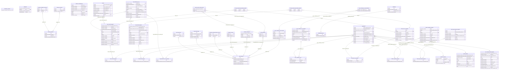

# Database

We use PostgreSQL as a persistent data store.

### Database migrations (Alembic)

Take a look at [Alembic](https://alembic.sqlalchemy.org/en/latest/cookbook.html#building-uptodate),
the project which handles migrations and schema versioning for SQLAlchemy.

To generate a migration script for your recent change you can use docker or
more easily, with rootless podman, you can use our make target.

Both expect that the `alembic upgrade head` is run in [run_httpd.sh](../../files/run_httpd.sh)
during (packit-)service pod/container start.

When modifying the migration manually, do not forget to update the downgrade
path as well. You can test that downgrade of the last migration passes by
running `alembic downgrade -1` in the service pod/container.
Make sure that the migration is self-sufficient and does not rely on models in
the `models.py` module. Otherwise, if the models change in the future, it would
not be possible to run the migrations in the correct order.
To satisfy this, add the state of models required by your migration to the
migration itself (i.e. copy the model from `models.py`)

#### with docker:

    $ docker-compose up service
    $ docker exec -ti service bash -c 'cd /src/; alembic revision -m "My change" --autogenerate'
    $ docker cp service:/src/alembic/versions/123456789abc_my_change.py .

#### with rootless podman

[Use podman with docker-compose](https://fedoramagazine.org/use-docker-compose-with-podman-to-orchestrate-containers-on-fedora).

    $ make migrate-db CHANGE="something new you did"

##### troubleshooting

If you get an error like this:

```
INFO  [alembic.runtime.migration] Context impl PostgresqlImpl.
INFO  [alembic.runtime.migration] Context impl PostgresqlImpl.
INFO  [alembic.runtime.migration] Will assume transactional DDL.
INFO  [alembic.runtime.migration] Will assume transactional DDL.
ERROR [alembic.util.messaging] Target database is not up to date.
ERROR [alembic.util.messaging] Target database is not up to date.
  FAILED: Target database is not up to date.
```

Chances are that the _packit service pod_ is not properly started or
for some reasons it is not running the
`alembic upgrade head` command.
It could also mean that your changes are too complicated for alembic
to autogenerate a migration. In such case, run the `alembic revision`
command without `--autogenerate` to create just the template and
write the migration commands manually.

### How to check what's inside postgres?

Get shell inside the container (or pod). E.g. with docker-compose:

    $ docker-compose exec -ti postgres bash
    bash-4.2$

Invoke psql interactive shell:

    bash-4.2$ psql
    psql (10.6)
    Type "help" for help.

    postgres=#

Connect to packit database:

    postgres=# \connect packit
    You are now connected to database "packit" as user "postgres".
    packit=#

Get help

    packit=# \?

or

    packit=# \h

List tables

    packit=# \dt
                List of relations
    Schema |      Name       | Type  | Owner
    --------+-----------------+-------+--------
    public | alembic_version | table | packit
    public | git_projects    | table | packit

Look inside a table

    packit=# select * from git_projects;
    id | namespace | repo_name
    ----+-----------+-----------
    (0 rows)

### ER Diagram


Beware, it might be outdated because it was generated manually
([download DBeaver](https://dbeaver.io/download),
[install](https://github.com/dbeaver/dbeaver/wiki/Installation),
[connect to (local) postgres](https://github.com/dbeaver/dbeaver/wiki/Create-Connection),
[see ER Diagram (tab) and export it](https://github.com/dbeaver/dbeaver/wiki/ER-Diagrams#diagram-export))
and it's not automatically re-generated.
For actual state see the [SQLAlchemy mappings (models)](../../packit_service/models.py).

You can also have a look at the [diagram](./diagram.mmd) in the Mermaid format generated by [mermerd](https://github.com/KarnerTh/mermerd). You can regenerate it from `docker-compose` by running

    make regenerate-db-diagram

### Backups

[Done periodically](https://github.com/packit/packit-service/blob/021e0818ae1ae2ebd9c1622192649dd3b6b1e532/packit_service/celery_config.py#L27),
stored in AWS S3 (`arr-packit-[prod|stg]` buckets),
see [this](https://source.redhat.com/departments/it/devit/it-infrastructure/itcloudservices/itpubliccloudpage/cloud/docs/internal/saml_authentication_for_red_hat_it_aws_accounts#commercial)
and [this](https://source.redhat.com/departments/it/devit/it-infrastructure/itcloudservices/itpubliccloudpage/cloud/docs/consumer/saml_manage_user_access)
for access.

### Using live data locally

Here is a list of commands to run if you need a local database with real data from stg or prod:

1. Obtain a DB dump, either:

- `oc rsh $POSTGRES_POD pg_dump packit >dump-$ENV-$DATE.sql` or
- from backups in [AWS](https://source.redhat.com/departments/it/devit/it-infrastructure/itcloudservices/itpubliccloudpage/cloud/docs/internal/saml_authentication_for_red_hat_it_aws_accounts#commercial),
  `arr-packit-[prod|stg]` S3 bucket

2. Load it into your local postgres instance:
   1. Create a database named packit and owned by the packit user: `postgres=# create database packit owner=packit;`
   2. Copy the dump file into the database container: `podman cp ./dump-$ENV-$DATE.sql postgres:/tmp`
      This is a more reliable option than a direct load from your local filesystem.
   3. Load the dump as a packit user `psql -U packit -d packit < /tmp/dump-$ENV-$DATE.sql`
      It's important to do this as a packit user because that's how worker and service pods connect.

### Deleting old data

See [db-cleanup script](https://github.com/packit/packit-service/blob/main/files/scripts/db-cleanup.py)
